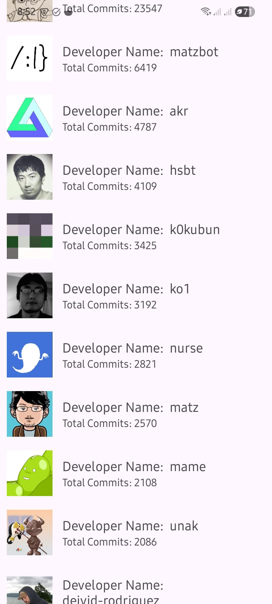

# Classic MVVM Android App (XML + RecyclerView)

This project is an Android application built with the **MVVM architecture**, demonstrating the use of **RecyclerView with XML layouts**, **Room database**, **Retrofit for API calls**, and **Hilt for dependency injection**.  

It fetches data from a remote API, caches it locally with Room, and displays it in a RecyclerView. Images are loaded efficiently using Glide.  

---

## 🚀 Features
- **MVVM Architecture** with ViewModel & LiveData  
- **RecyclerView** for list display (XML layouts)  
- **Retrofit2** + **OkHttp** + **Gson Converter** for API integration  
- **Room Database** for local caching  
- **Coroutines** for asynchronous operations  
- **Glide** for image loading and caching  
- **Dagger Hilt** for dependency injection  

---
 
## 🛠️ Tech Stack
- **Language:** Kotlin  
- **UI:** XML layouts + RecyclerView  
- **Networking:** Retrofit2, OkHttp, Logging Interceptor  
- **Database:** Room (2.6.1)  
- **Image Loading:** Glide (4.16.0)  
- **DI:** Dagger Hilt (2.51.1)  
- **Async:** Kotlin Coroutines (1.8.0)  
- **Lifecycle:** ViewModel + LiveData (2.8.7)  

---

## 📸 Screenshots

  

